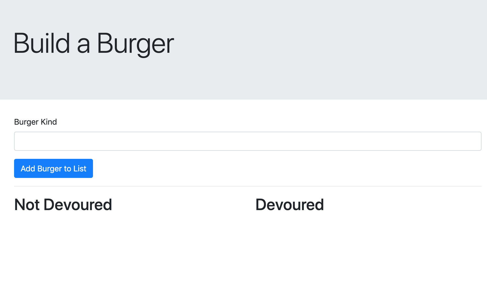
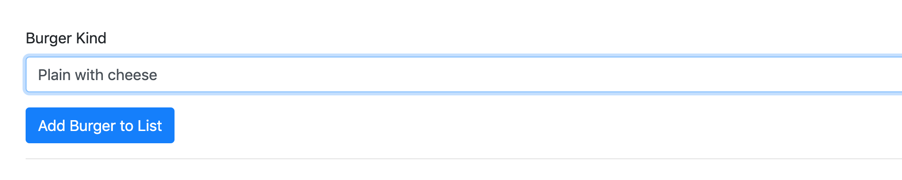
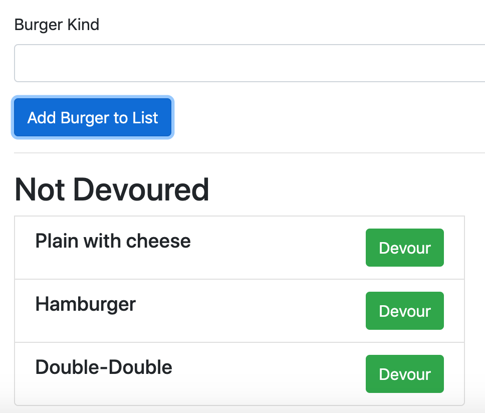
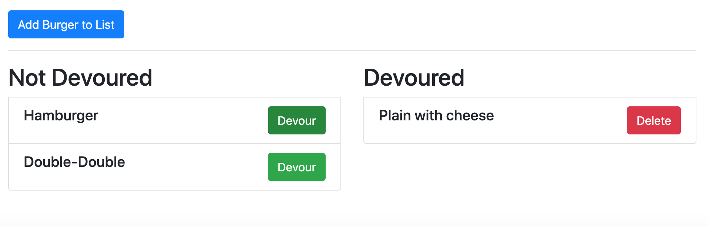
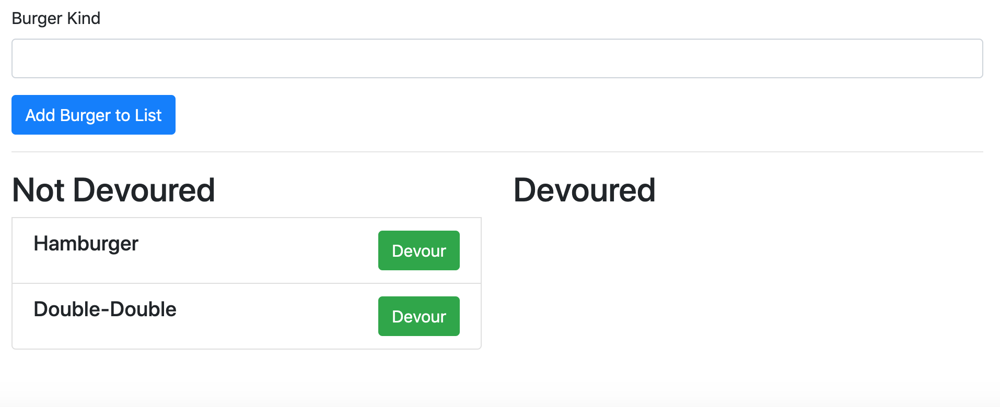

# Burger app

Created by me: *Danielle Hillman*
Link to repo: https://github.com/daniellehillman/burger

## Build a Burger

After starting the program, the user can input a list of burgers that they would like.

### Add Burger

### Add More

The list extents for as many as the user adds.

### Devour

If the user "devours" the burger and clicks the button, that burger moves to the devoured column.

Then once you delete the burger, it is removed from the list.

